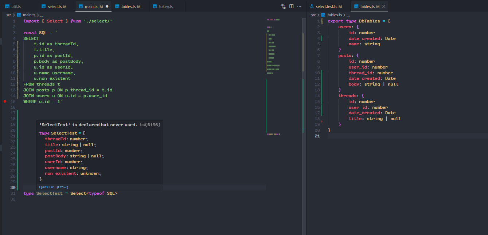

# sql-ts-map

This is a proof of concept method for inferring Typescript types from a string literal containing raw SQL.

It is assuming database introspection wad used to create a [generated Typescript type](./src/tables.ts) that corresponds to the database's schema.

No other code generation is used.

T run:
1. `npm i` from the project root
1. navigate to [main.ts](./src/main.ts) and mouseover SelectTest

